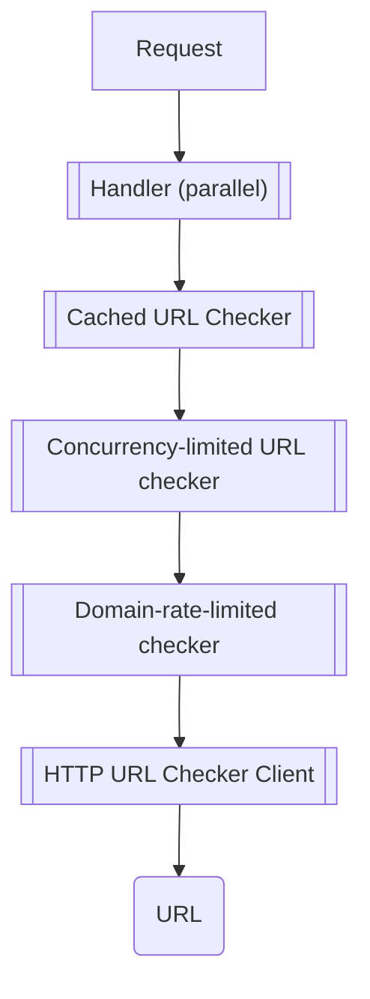

# Link Checker Service

The Link Checker web service runs cached and otherwise optimized broken link checks.

Endpoints:
  - `/checkUrls` checks a batch at once
  - `/checkUrls/stream` returns results as they arrive using [JSON streaming](https://en.wikipedia.org/wiki/JSON_streaming)
  - `/version` returns the server version


## Installing

```
go get -u github.com/siemens/link-checker-service
```

## Motivation

For a website author willing provide a link checking functionality there are few options available.
Browser requests to other domains are most likely to be blocked by
[CORS](https://en.wikipedia.org/wiki/Cross-origin_resource_sharing). Building the link-checking functionality
into the back-end might compromise the stability of the service through exhaustion of various resources.

Thus, to minimize risk, a link checker should be isolated into a separate service. While there are several websites providing the functionality, these may not have access to hosts on a private network, and are otherwise not under your control.

Checking whether a link is broken seems like a trivial task, but consider checking a thousand links a thousand times.
Several optimizations and server, gateways, CDN or proxy implementation peculiarity work-arounds will need to be applied. This repository contains an implementation of such service.

## Example Request

Start the server, e.g. `link-checker-service serve`, and send the following request body to `http://localhost:8080/checkUrls`:

```json
{
    "urls": [
        {
            "url":"https://google.com",
            "context": "0"
        },
        {
            "url":"https://ashdfkjhdf.com/kajhsd",
            "context": "1"
        }
    ]
}
```

e.g. via [HTTPie](https://httpie.org/docs#explicit-json) on windows cmd

```
http POST localhost:8080/checkUrls urls:="[{"""url""":"""https://google.com""","""context""":"""0"""},{"""url""":"""https://baskldjha.com/loaksd""","""context""":"""1"""}]"
```

The context field allows correlating the requests on the client side.

Sample response:

```json
{
    "result": "complete",
    "urls": [
        {
          "context": "1",
            "error": "cannot access 'https://baskldjha.com/loaksd'... no such host",
            "http_status": 528,
            "status": "broken",
            "timestamp": 1599132784,
            "body_patterns_found": [],
            "url": "https://baskldjha.com/loaksd"
        },
        {
            "context": "0",
            "error": "",
            "http_status": 200,
            "status": "ok",
            "timestamp": 1599132784,
            "body_patterns_found": [],
            "url": "https://google.com"
        }
    ]
}
```

## Configuration

For up-to-date help, check `link-checker-service help` or `link-checker-service help <command>`.

To override the service port, define the `PORT` environment variable.

### Config File

A sample configuration file [configuration file](.link-checker-service.toml) is available, with most possible configuration options listed.


Start the app with the path to the configuration file: `--config <path-to-config-toml>`.

### Environment Variables

Most configuration values can also be overridden via environment variables in the [12-factor](https://12factor.net/) fashion.

The variables found in the configuration file can be upper-cased and prefixed with `LCS_` to override.

Arrays of strings can be defined delimited by a space, e.g.:

```
LCS_CORSORIGINS="http://localhost:8080 http://localhost:8092"
```

For complex keys, such as `HTTPClient.userAgent`, take the uppercase key and replace the dot with an underscore:

```
LCS_HTTPCLIENT_USERAGENT="lcs/2.0"
```

### Advanced Configuration

Link checker can optionally detect patterns within successful HTTP response bodies, e.g. in pages with authentication.
This configuration is only possible via the [configuration file](.link-checker-service.toml):

```toml
# enable searching for patterns here
searchForBodyPatterns = true

# define Go Regex patterns and their names in this manner
[[bodyPatterns]]
name = "authentication redirect"
regex = "Authentication Redirect"

[[bodyPatterns]]
name = "google"
regex = "google"
```

The names of the found patterns will be available in the URL check results.


## Development

### CI

[CI](https://github.com/siemens/link-checker-service/-/pipelines) creates executables for Linux/amd64 and Windows

### Running the Service

```
go run . serve
```

or dockerized, without installing Go:

```
docker-compose up
```

### Using a Custom Configuration

e.g. when a proxy is needed for the HTTP client, see the sample [.link-checker-service.toml](.link-checker-service.toml),
and start the server with the argument: `--config .link-checker-service.toml`

alternatively, set the client proxy via an environment variable: `LCS_PROXY=http://myproxy:8080`

### Running the Tests

```
go test -v ./...
```

### Generating Serializers

```
go generate -v ./...
```


### Load Testing

via [hey](https://github.com/rakyll/hey):

```
hey -m POST -n 10000 -c 300 -T "application/json" -t 30 -D sample_request_body.json http://localhost:8080/checkUrls
```

where the `-c 300` is the client concurrency setting, and `-n 10000` is the approximate total number of requests to fire.

01.09.2020:

```
>hey -m POST -n 10000 -c 200 -T "application/json" -t 30 -D sample_request_body.json http://localhost:8080/checkUrls

Summary:
  Total:        0.2867 secs
  Slowest:      0.0933 secs
  Fastest:      0.0002 secs
  Average:      0.0052 secs
  Requests/sec: 34879.9936

  Total data:   3950000 bytes
  Size/request: 395 bytes

Response time histogram:
  0.000 [1]     |
  0.009 [8720]  |■■■■■■■■■■■■■■■■■■■■■■■■■■■■■■■■■■■■■■■■
  0.019 [988]   |■■■■■
  0.028 [83]    |
  0.037 [47]    |
  0.047 [57]    |
  0.056 [29]    |
  0.065 [27]    |
  0.075 [15]    |
  0.084 [11]    |
  0.093 [22]    |


Latency distribution:
  10% in 0.0004 secs
  25% in 0.0011 secs
  50% in 0.0032 secs
  75% in 0.0060 secs
  90% in 0.0109 secs
  95% in 0.0146 secs
  99% in 0.0485 secs

Details (average, fastest, slowest):
  DNS+dialup:   0.0004 secs, 0.0002 secs, 0.0933 secs
  DNS-lookup:   0.0004 secs, 0.0000 secs, 0.0262 secs
  req write:    0.0000 secs, 0.0000 secs, 0.0080 secs
  resp wait:    0.0043 secs, 0.0001 secs, 0.0632 secs
  resp read:    0.0003 secs, 0.0000 secs, 0.0117 secs

Status code distribution:
  [200] 10000 responses
```

### Request Optimization Architecture



Rate limiting based on IPs can be turned on in the configuration via a rate specification.
See [ulule/limiter](https://github.com/ulule/limiter).

Blocked IPs will run into HTTP 429, and will be unblocked after the sliding window duration passes:

`hey -m POST -n 1000 -c 200 -T "application/json" -t 30 -D sample_request_body.json http://localhost:8080/checkUrls` with a limit of `10-S`:

```
Status code distribution:
  [200] 10 responses
  [429] 990 responses
```

### Large Requests Using JSON Streaming

JSON Streaming can be used to optimize the client user experience, so that the client
does not have to wait for the whole check result to complete to render.

In the sample HTTPie request, post the streaming request to the `/checkUrls/stream` endpoint:
```
http --stream  POST  localhost:8080/checkUrls/stream ...
```

URL check result objects will be streamed continuously, delimited by a newline character `\n`, as they become available.
These can then be rendered immediately. E.g. see the [sample UI](test/jquery_example/public/index.html).

### Dependencies

- Go (1.15)
- see [go.mod](go.mod)

### Samples

- [test/large_list_check](test/large_list_check) - crawls a markdown page for URLs and checks them via the running link checker service
- [test/jquery_example](test/jquery_example) - example usage of the service from a simple page to check links and display the results using jQuery

## Alternatives

the alternatives that are not URL list check web services:

- HTML/Markdown crawlers & checkers
    - https://github.com/stevenvachon/broken-link-checker
    - https://github.com/JustinBeckwith/linkinator
    - https://github.com/bmuschko/link-verifier
    - https://github.com/raviqqe/liche
    - https://github.com/raviqqe/muffet
    - https://github.com/victoriadrake/hydra-link-checker
    - https://github.com/tcort/markdown-link-check
- URL checkers
    - https://github.com/1ndianl33t/urlprobe
    - https://github.com/tomnomnom/burl

some URL check services exist, albeit not open source (as of 02.09.2020)


## License

    Copyright 2020 Siemens AG and contributors as noted in the AUTHORS file.


    This Source Code Form is subject to the terms of the Mozilla Public
    License, v. 2.0. If a copy of the MPL was not distributed with this
    file, You can obtain one at http://mozilla.org/MPL/2.0/


The following sample code folders are licensed under [Attribution-ShareAlike 4.0 International (CC BY-SA 4.0)](https://creativecommons.org/licenses/by-sa/4.0/)

- [test/jquery_example](test/jquery_example)
- [test/large_list_check](test/large_list_check)


The [testing work-around](main_test_support.go) for streaming responses has been adapted from [gin](https://github.com/gin-gonic/gin/blob/ce20f107f5dc498ec7489d7739541a25dcd48463/context_test.go#L1747-L1765) (Copyright Manu Martinez-Almeida, MIT License)


## Disclaimer

The external hyperlinks found in this repository, and the information contained therein, do not constitute endorsement by the authors, and are used either for documentation purposes, or as examples.
