# Link Checker Service

The Link Checker web service runs cached and otherwise optimized broken link checks.

[](https://travis-ci.org/siemens/link-checker-service) [](https://goreportcard.com/report/github.com/siemens/link-checker-service) 

Endpoints:

- `/checkUrls` checks a batch at once
- `/checkUrls/stream` returns results as they arrive using [JSON streaming](https://en.wikipedia.org/wiki/JSON_streaming)
- `/version` returns the server version
- `/livez`, `/readyz` health checks

## Quickstart Options

- get the binary into `$GOPATH/bin`


```
go get -u github.com/siemens/link-checker-service
```

&darr;

```
link-checker-service serve
```

- download it from the [releases](https://github.com/siemens/link-checker-service/releases/latest)

- run the service dockerized, without installing Go, and navigate to the [sample UI](http://localhost:8092):

```bash
docker-compose up --build
```

- run from source:

```bash
go run . serve
```

## Motivation

For a website author willing provide a link checking functionality there are few options available.
Browser requests to other domains are most likely to be blocked by
[CORS](https://en.wikipedia.org/wiki/Cross-origin_resource_sharing). Building the link-checking functionality
into the back-end might compromise the stability of the service through exhaustion of various resources.

Thus, to minimize risk, a link checker should be isolated into a separate service. While there are several websites providing the functionality, these may not have access to hosts on a private network, and are otherwise not under your control.

Checking whether a link is broken seems like a trivial task, but consider checking a thousand links a thousand times.
Several optimizations and server, gateways, CDN or proxy implementation peculiarity work-arounds will need to be applied. This repository contains an implementation of such service.

## Usage

### Example Request

Start the server, e.g. `link-checker-service serve`, and send the following request body to `http://localhost:8080/checkUrls`:

```json
{
    "urls": [
        {
            "url":"https://google.com",
            "context": "0"
        },
        {
            "url":"https://ashdfkjhdf.com/kajhsd",
            "context": "1"
        }
    ]
}
```

e.g. via [HTTPie](https://httpie.org/docs#explicit-json) on Windows cmd

```cmd
http POST localhost:8080/checkUrls urls:="[{"""url""":"""https://google.com""","""context""":"""0"""},{"""url""":"""https://baskldjha.com/loaksd""","""context""":"""1"""}]"
```

or in *sh:

```bash
http POST localhost:8080/checkUrls urls:='[{"url":"https://google.com","context":"0"},{"url":"https://baskldjha.com/loaksd","context":"1"}]'
```

The context field allows correlating the requests on the client side.

Sample response:

```json
{
    "result": "complete",
    "urls": [
        {
          "context": "1",
            "error": "cannot access 'https://baskldjha.com/loaksd'... no such host",
            "http_status": 528,
            "status": "broken",
            "timestamp": 1599132784,
            "body_patterns_found": [],
            "url": "https://baskldjha.com/loaksd"
        },
        {
            "context": "0",
            "error": "",
            "http_status": 200,
            "status": "ok",
            "timestamp": 1599132784,
            "body_patterns_found": [],
            "url": "https://google.com"
        }
    ]
}
```

### Large Requests Using JSON Streaming

JSON Streaming can be used to optimize the client user experience, so that the client
does not have to wait for the whole check result to complete to render.

In the sample HTTPie request, post the streaming request to the `/checkUrls/stream` endpoint:

```bash
http --stream  POST  localhost:8080/checkUrls/stream ...
```

URL check result objects will be streamed continuously, delimited by a newline character `\n`, as they become available.
These can then be rendered immediately. E.g. see the [sample UI](test/jquery_example/public/index.html).

### Sample Front-Ends

- For a programmatic large URL list check, see [test/large_list_check](test/large_list_check), which crawls a markdown page for URLs and checks them via the running link checker service
- For an example of a simple page to check links and display the results using jQuery using the service, see [test/jquery_example](test/jquery_example)

## Configuration

For up-to-date help, check `link-checker-service help` or `link-checker-service help <command>`.

To override the service port, define the `PORT` environment variable.

To bind to another address, configure the `bindAddress` option, i.e.: `... serve -a 127.0.0.1:8080`

### Config File

A sample configuration file [configuration file](.link-checker-service.toml) is available, with most possible configuration options listed.

Start the app with the path to the configuration file: `--config <path-to-config-toml>`.

### Environment Variables

Most configuration values can also be overridden via environment variables in the [12-factor](https://12factor.net/) fashion.

The variables found in the configuration file can be upper-cased and prefixed with `LCS_` to override.

Arrays of strings can be defined delimited by a space, e.g.:

```
LCS_CORSORIGINS="http://localhost:8080 http://localhost:8092"
```

For complex keys, such as `HTTPClient.userAgent`, take the uppercase key and replace the dot with an underscore:

```
LCS_HTTPCLIENT_USERAGENT="lcs/2.0"
```

### Authentication

The server implements a simple optional authentication via JWT token validation using a public certificate (middleware: [github.com/appleboy/gin-jwt](https://github.com/appleboy/gin-jwt)).

[Currently](https://github.com/appleboy/gin-jwt/issues/236), the JWT middleware requires a dummy private
certificate to be configured, even though it is not used for validation.

See the [configuration file](.link-checker-service.toml) and the `serve` command help for detailed settings.

### URL Checker Plugins

URLs may be checked using different methods, e.g. with an HTTP client with or without using a proxy.
Depending on the connectivity available to the link checker service, the sequence of checks can be influenced
via a configuration of the URL Checker Plugins.

E.g.:

```toml
urlCheckerPlugins = [
    "urlcheck-noproxy",
    "urlcheck",
    "urlcheck-pac",
]
```

By default, the `urlcheck` plugin is used, which uses an HTTP client with a proxy, if one is configured,
and without one, if not. `urlcheck-noproxy` uses a client explicitly without a proxy set.
`urlcheck-pac` generates a client for each URL depending on the proxy configuration returned via the
PAC script, configured via the `pacScriptURL` option. Only the first proxy returned by the PAC script will be used.

### Advanced Configuration

Link checker can optionally detect patterns within successful HTTP response bodies, e.g. in pages with authentication.
This configuration is only possible via the [configuration file](.link-checker-service.toml):

```toml
# enable searching for patterns here
searchForBodyPatterns = true

# define Go Regex patterns and their names in this manner
[[bodyPatterns]]
name = "authentication redirect"
regex = "Authentication Redirect"

[[bodyPatterns]]
name = "google"
regex = "google"
```

The names of the found patterns will be available in the URL check results.


### Using a Custom Configuration

e.g. when a proxy is needed for the HTTP client, see the sample [.link-checker-service.toml](.link-checker-service.toml),
and start the server with the argument: `--config .link-checker-service.toml`

alternatively, set the client proxy via an environment variable: `LCS_PROXY=http://myproxy:8080`

## Development

see [development.md](development.md)

## Request Optimization Architecture



Rate limiting based on IPs can be turned on in the configuration via a rate specification.
See [ulule/limiter](https://github.com/ulule/limiter).

Blocked IPs will run into HTTP 429, and will be unblocked after the sliding window duration passes:

`hey -m POST -n 1000 -c 200 -T "application/json" -t 30 -D sample_request_body.json http://localhost:8080/checkUrls` with a limit of `10-S`:

```
Status code distribution:
  [200] 10 responses
  [429] 990 responses
```

## Dependencies

- Go (1.15)
- see [go.mod](go.mod)

## Alternatives

the alternatives that are not URL list check web services:

- HTML/Markdown crawlers & checkers
    - https://github.com/stevenvachon/broken-link-checker
    - https://github.com/JustinBeckwith/linkinator
    - https://github.com/bmuschko/link-verifier
    - https://github.com/raviqqe/liche
    - https://github.com/raviqqe/muffet
    - https://github.com/victoriadrake/hydra-link-checker
    - https://github.com/tcort/markdown-link-check
- URL checkers
    - https://github.com/1ndianl33t/urlprobe
    - https://github.com/tomnomnom/burl

some URL check services exist, albeit not open source (as of 02.09.2020)

## License

```text
    Copyright 2020 Siemens AG and contributors as noted in the AUTHORS file.

    This Source Code Form is subject to the terms of the Mozilla Public
    License, v. 2.0. If a copy of the MPL was not distributed with this
    file, You can obtain one at http://mozilla.org/MPL/2.0/
```

The following sample code folders are licensed under [Attribution-ShareAlike 4.0 International (CC BY-SA 4.0)](https://creativecommons.org/licenses/by-sa/4.0/)

- [test/jquery_example](test/jquery_example)
- [test/large_list_check](test/large_list_check)

The [testing work-around](main_test_support.go) for streaming responses has been adapted from [gin](https://github.com/gin-gonic/gin/blob/ce20f107f5dc498ec7489d7739541a25dcd48463/context_test.go#L1747-L1765) (Copyright Manu Martinez-Almeida, MIT License)

## Disclaimer

The external hyperlinks found in this repository, and the information contained therein, do not constitute endorsement by the authors, and are used either for documentation purposes, or as examples.
